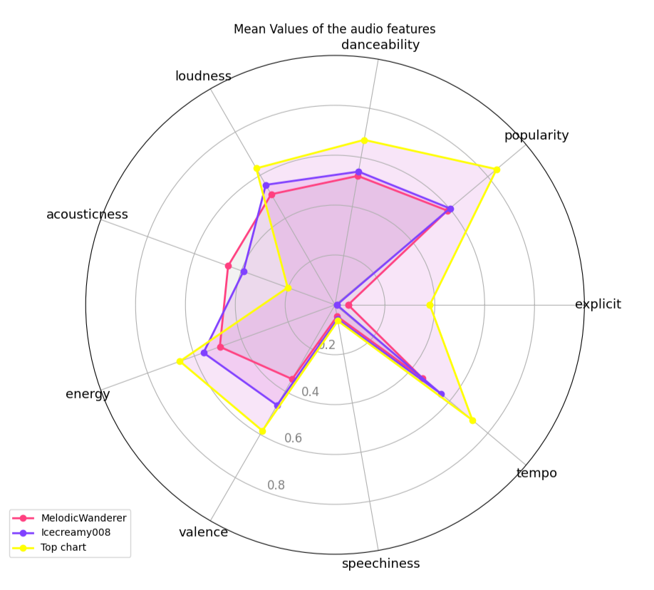
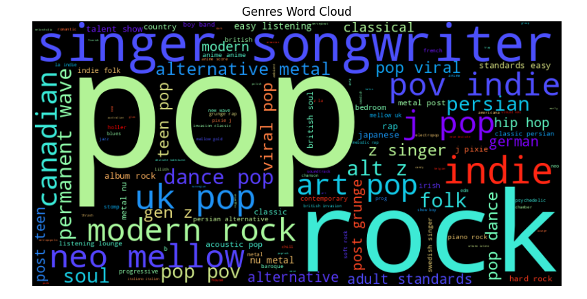
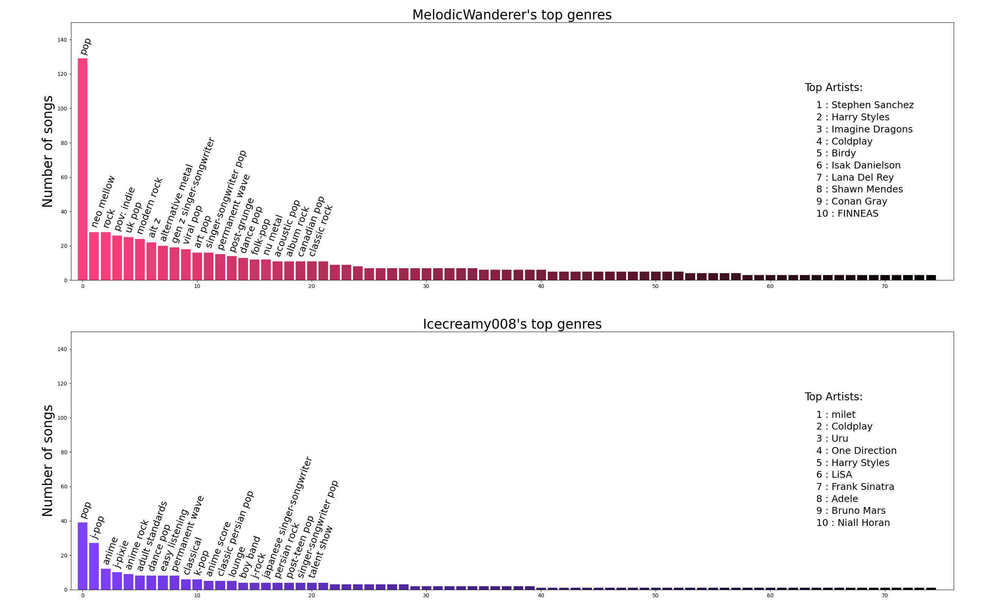
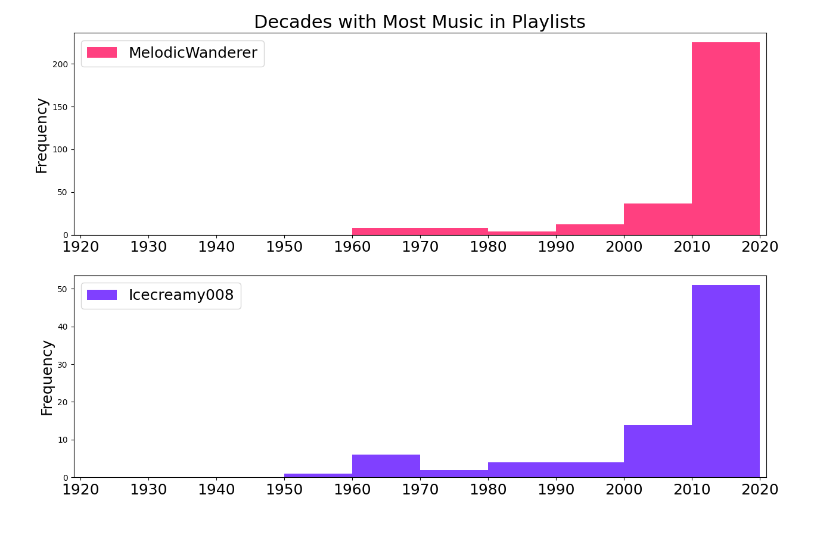
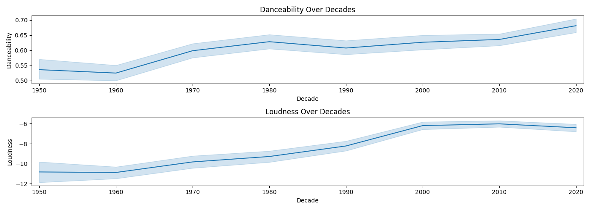
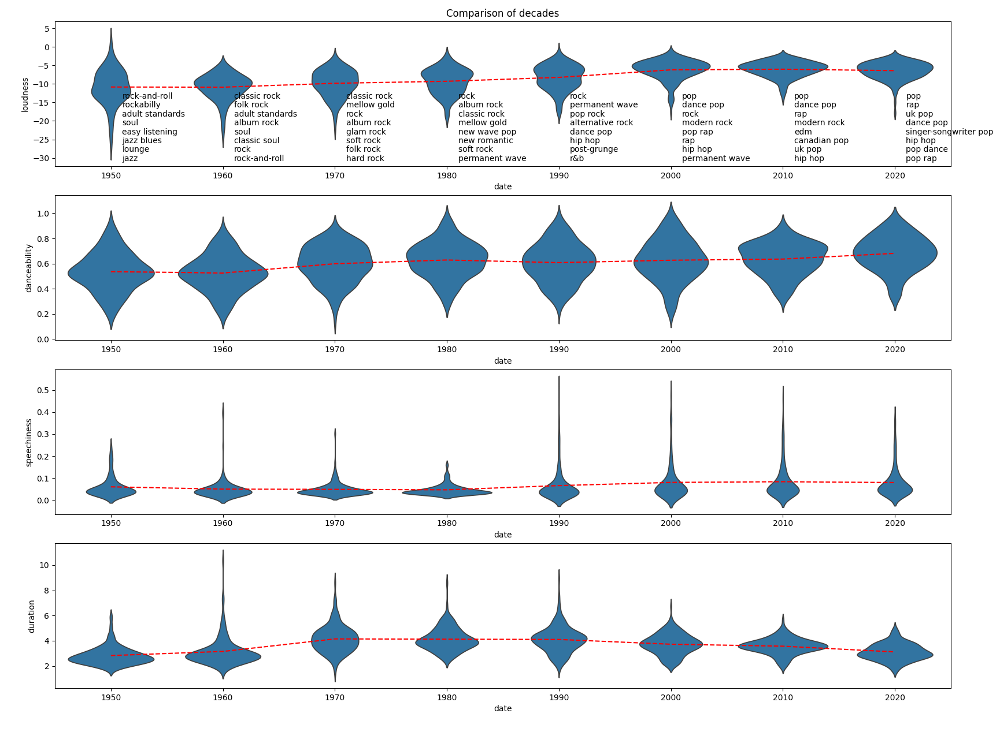
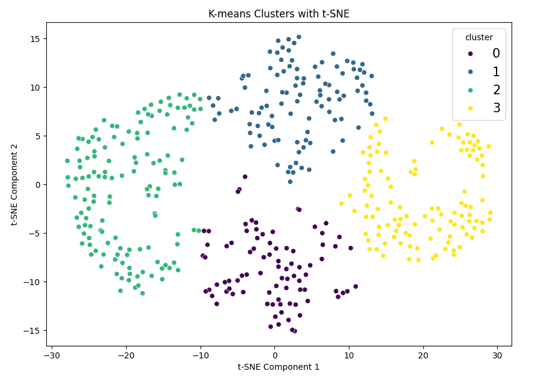

# Spotify Data Analysis :headphones: :notes:

During my data science learning journey, I decided to put my new skills into practice in a real-world context by analyzing my music data.

I collected data from my own Spotify playlists and a friend's playlist, diving deep into the realm of Exploratory Data Analysis (EDA).

Here's the process I followed:
## Collecting Data Using the Spotify API

I gathered track information and details from playlists using Spotipy, a library that wraps Spotify's RESTful API.

With Spotipy, I fetched detailed song information, including track name, artist, duration, and audio features. 

It’s crucial to obtain your client ID and secret from [Spotify Developer's page](https://developer.spotify.com/) prior to using Spotipy. 
You can do this by following the guide at [this helpful link](https://support.heateor.com/get-spotify-client-id-client-secret/).

## Data Analysis and Visualization
After collecting the data, I delved into data analysis and visualization. The insights gained revealed intriguing patterns and comparisons.

### :musical_score: Results
for more analysis go to [Spotify_Data_Analysis.ipynb](Spotify_Data_Analysis.ipynb) 
#### Some comparisons among the music taste of myself (MelodicWanderer), my friend (Icecreamy008), and the top hits:

#### What has changed in music through time? 

 

## k-Means Clustering via PCA and tSNE-Reduction
The songs obtained above, along with their audio features, provided the basis for my k-Means clustering model. I used both t-distributed stochastic neighbor embedding (t-SNE) and principal component analysis (PCA) to reduce the high-dimensional data into a two-dimensional dataset. To visualize my clustering model, I used the Python packages Seaborn and Matplotlib to showcase the distinction of genres.

## My Spotify

 

You can try this yourself to discover what your music says about you!

For more data practices, it might be a good idea to create personal music recommendation systems.
